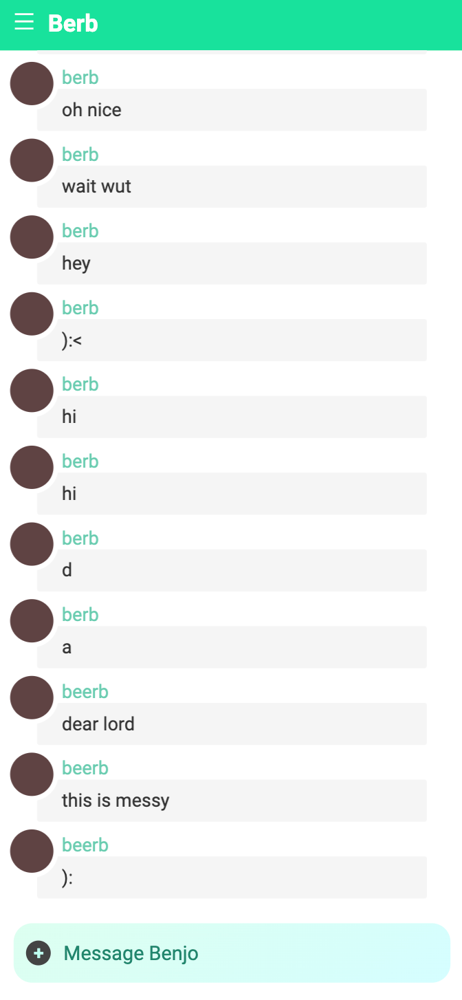
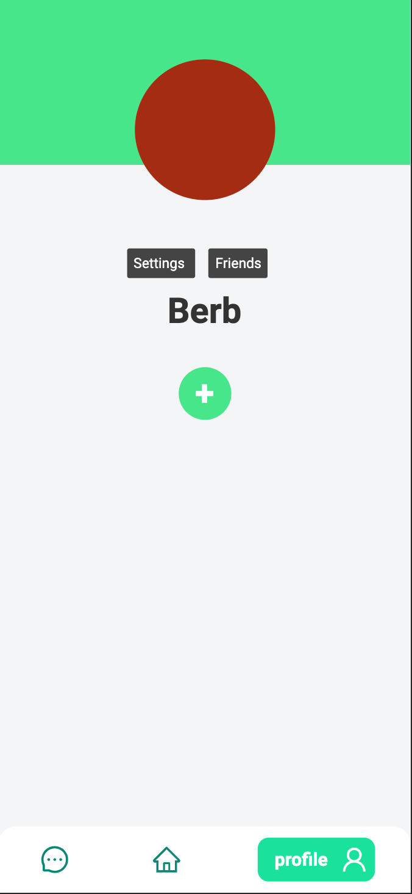
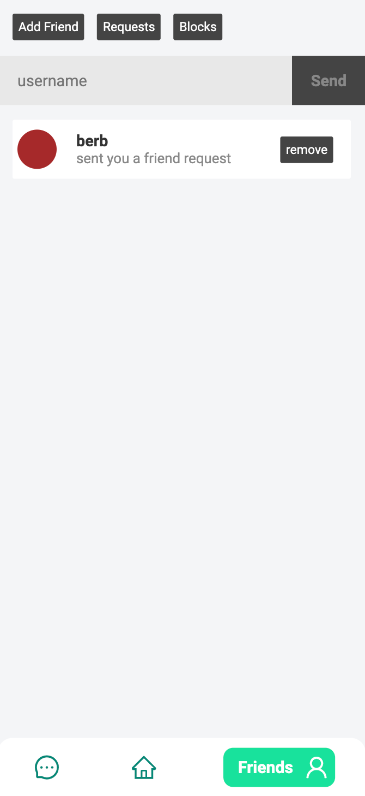

# Trist
Minimal social network utilizing (some) domain driven design.

-----


<div style="display: flex">
  
  
  
</div>

-----

### Getting Started
As easy as one, two, three.

##### Prerequisites

Install [Node](https://nodejs.org/)

##### 1 - Make a folder to put your new Trist
```
mkdir <folder_name>
cd <folder_name>
```
or just make one however you like.
##### 2 - Clone this repository
```
git clone https://github.com/c-d-t/trist.git
```
##### 2.5 - Download dependecies
```
cd server
npm run init
```
##### 3 - Run your development server
```
npm run dev
```
